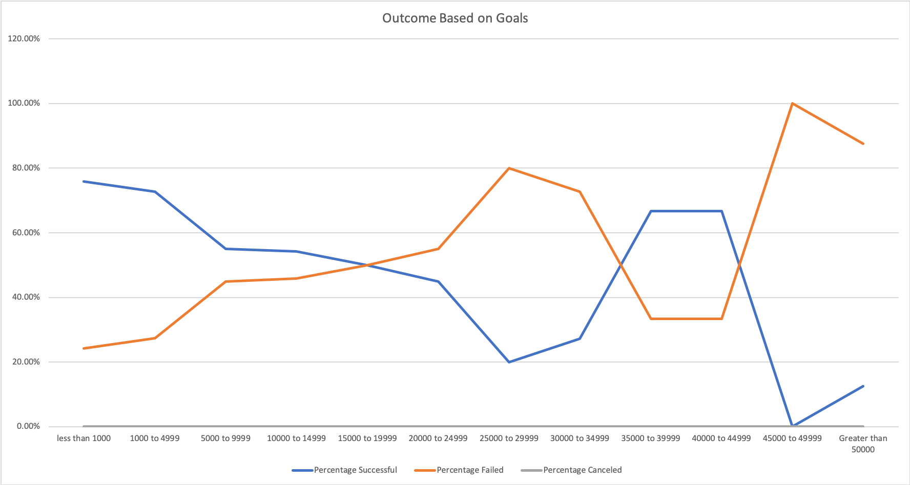
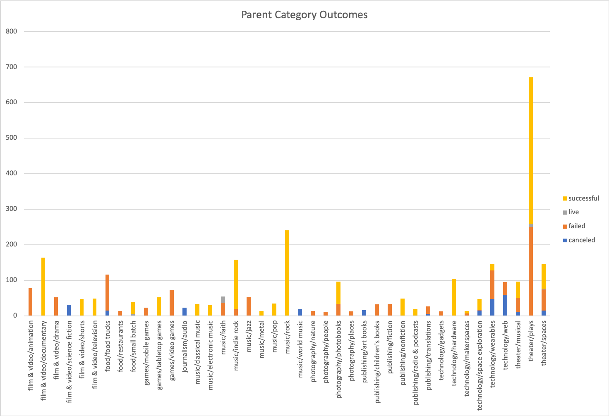

# Kickstarter-analysis Challenge
Performing analysis on kickstarter data to uncover trend

### Challenge

# Outcome based on Goals
 
 
# Outcome based on Launch Date

# Category Outcomes

The data interpreted here is based on kickstarter data only, it is possible there are influences beyond this data set that may change the outcome of future outcome.  From the kickstarter data that we have anlayzed, Theater category fundaraisers with launch dates around May has the most success rate.  For subcategory of Plays, the outcome of success seems to suggest goals of up to 44999.   For plays, outcome goals greater than 44999 has a high chance of failure.  Out of all successful pledges, amount of 1001 to 2001  is the most popular amount, the data set shows there are 307 successful projects pledged for this amount.  A graph showing all pledge amount grouped by 1000s increment would give us a sense on popular pledge amounts.  
